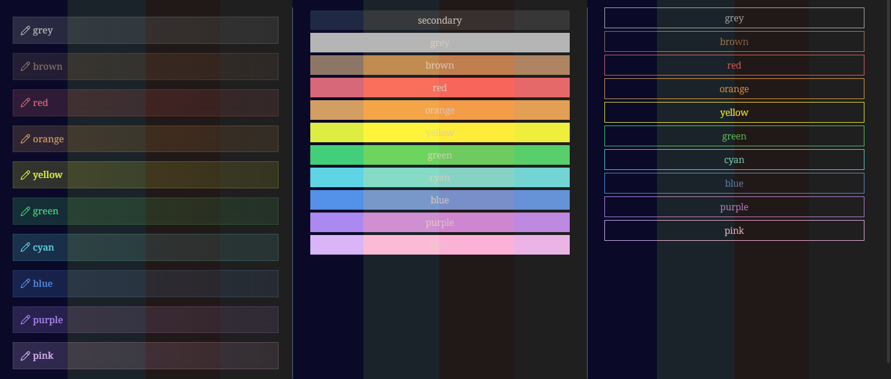
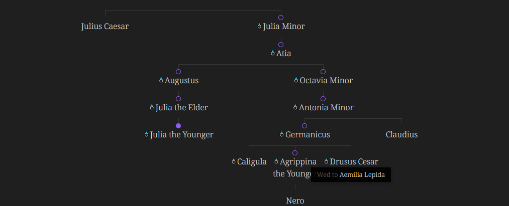

FANCY A STORY
=============

**By Kapirklaa**

I started working on this theme because
- I wanted to have fun with CSS
- I wanted a theme that would create an inspiring environment when I'm working on my worldbuilding, TTRPG, investigation projects.

It is still a work in progress. If you're interested in new features, feel free to open an issue to request one.
I am not expecting this theme to be for everyone, it is not the lightest one and can be heavy to look at.

> [!WARNING]
> Still not tested on tablet or mobile

**Documentation**: https://elsatam.github.io/obsidian-fancy-a-story/
**Backlog**: https://github.com/users/ElsaTam/projects/1/views/1

Installation
------------

### Using BRAT

Install this theme using [BRAT](https://github.com/TfTHacker/obsidian42-brat) by doing the following:
- Install and enable the BRAT plugin in your vault.
- Go to Settings → BRAT → Beta Themes List → Add Beta Theme.
- Specify `https://github.com/ElsaTam/obsidian-fancy-a-story` into the input field.
- Clik "Add Theme".

Some screenshots in random order
--------------------------------

### Overview

### File explorer

 

Every panes in the sidebar use a background texture. The coffee stain is only in the file explorer. These backgrounds can be disabled in the Style Settings plugin, in the Accessibility section.

### Different light schemes

The dynamic color palette is created only for the available pre-computed schemes. If you're using custom primary/text colors (for exampl with the Custom theme variant that let you choose this option), the colot palette won't adapt to your choices.

### Task list icons

### Family tree

### Tree view

### Invisible embeds

### Tables

You can enable an other style in the Style settings plugin:
