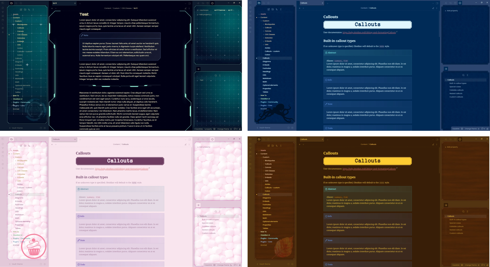

FANCY A STORY
=============

<strong style="color: white;">Minimal Installer version</strong>: 1.6.5 
<strong style="color: white;">How to check</strong>: go in Settings > General, and check the Installer Version. It is <em>under</em> the current version of Obsidian. 
<strong style="color: white;">How to solve</strong>: if the Installer version is too low, download the latest version of Obsidian from the official website and install it again.

[Read the **documentation**](https://elsatam.github.io/obsidian-fancy-a-story/) to see how to use all the features and settings of the theme!

Installation
------------

### From Obsidian community themes

- Go to Settings → Appearance → "Manage" button.
- Search for "Fancy-a-Story".
- Click "Install and use".

### Using BRAT

Install this theme using [BRAT](https://github.com/TfTHacker/obsidian42-brat) by doing the following:
- Install and enable the BRAT plugin in your vault.
- Go to Settings → BRAT → Beta Themes List → Add Beta Theme.
- Specify `https://github.com/ElsaTam/obsidian-fancy-a-story` into the input field.
- Click "Add Theme".

### Style Settings

It is recommended to us the Style Settings plugin to adjust the theme to your liking. See the theme documentation for further details.

### Snippets

I tried as much as I can do atomized the code in multiple snippets. You can find them in the [snippets/](snippets/) folder.
I could not test them all. So if you stumble in any bug, please do open an [issue](https://github.com/ElsaTam/obsidian-fancy-a-story/issues) on GitHub and I will fix it as soon as possible.

Features
--------

- Dark and Light mode
- Style settings options
- Alternative checkboxes
- Handwritten checkboxes and list bullets
- Various callouts styling (autopsy report, cards deck, clue, comic, conversation, email, infobox, film-strip, letter, paper fold, pinned, poem, polaroid, profile, screen, timeline)
- Helper callouts (blank, grid, masonry) and metadata (colors, positioning, ...)
- CSS classes (banners, columns, confidential, minimalist, movie-script, newspaper, no title, wide page, sci-fi, ..)
- List styling (tree view, family tree, reversed lists)
- Blockquotes (with citation, to caption an image, to add a tooltip to an image)
- Asides
- Cards deck for dataview
- Faded embeds (blending in the flow of the text)
- Cassette visual for embed audio
- Rainbow folder

Screenshots
-----------

You can choose from different predefined color schemes, or pick your own because I'm not so good at finding good palettes.

Within the Style Settings plugin, you can also choose your own sidebar textures to adapt the app to your liking.

Credits and Thanks
------------------

I would love to thanks all those people for their feedbacks, encouragements, and propositions during the development of the theme. Thank you also to some of you for your patience with the multiple times I broke the theme and the snippets while you were using them!
- Aanu
- icy
- Data
- Em
- Gandalf
- kmfrog
- Martin Crendraven
- moss▲FLUX
- rakudo
- RavenRaconteur
- Reynard
- shetland_pone
- tif
- TundraMoonlight
- … and all the others in the [Discord thread](https://discord.com/channels/686053708261228577/1283473301682786305)

Credit to these projects for some inspiration!
- [ITS](https://github.com/SlRvb/Obsidian--ITS-Theme) by SlRvb, for the fas-infobox callout and the alternative checkboxes
- [Minimal](https://github.com/kepano/obsidian-minimal) by kepano, for the alternative checkboxes
- [Limelight](https://github.com/smikula/obsidian-limelight/tree/master) by smikula, modified code by tif, for the Highlight active note feature
- [Rainbow folder titles](https://github.com/r-u-s-h-i-k-e-s-h/Obsidian-CSS-Snippets/blob/Collection/Snippets/File%20explorer%20styling%20-%20Rainbow%20folder%20titles.md) by sailKite

# Contact

If you find any issue with the theme, or want a new addition to it, please open an [issue](https://github.com/ElsaTam/obsidian-fancy-a-story/issues) on GitHub :)

I can also be pinged on the Obsidian Discord server under the tag @Kapirklaa.

# Licenses

As of 2024-10-24, the code is available as open source under the [GNU General Public License version 3 (GPLv3) License](LICENSE). It was previously released under the MIT License.

It uses different assets (fonts, images, icons) that are embeds in the CSS directly. You can find all the associated licenses in [docs/docs/assets_licenses.md](docs/docs/assets_licenses.md).
